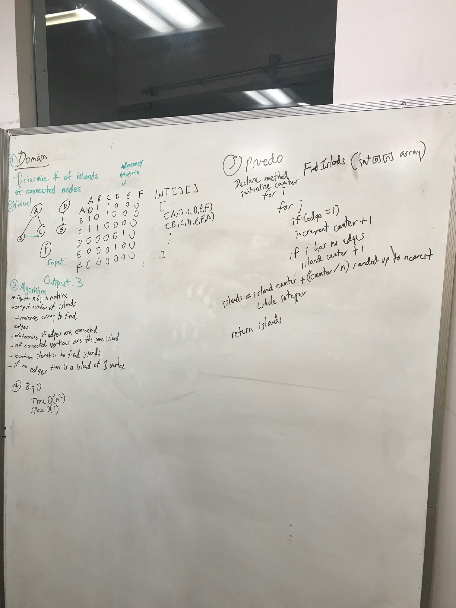

# Find Islands
"Determine the number of Islands of connected nodes"

## Challenge
The challenge was to see how many islands could be found in a given graph. Traversal would not function the way it should because traversals would with connected graphs. If they are disconnected, the traversal would end. We feel that changing the root node until there aren't any nodes left would work. Some sort of a recursion method. But the other possibility is using an adjacency list. Or a multidimensional array. And checking which numbers matched and were connected and not.

## Solution

# Acknowledgements
Whiteboarding Partner - Jesse Atay