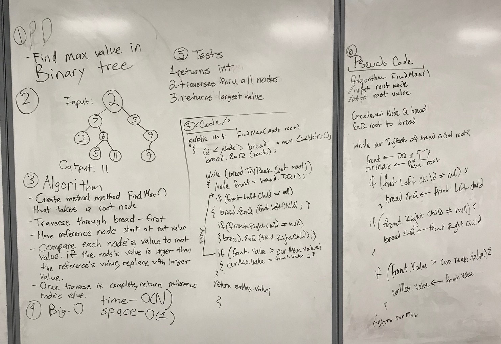

# Find Maximum Value in Binary Tree
"Find the Maximum Value in a Binary Tree"

## Challenge
The challenge was to figure out how to traverse through the binary tree. First, have the root node. And iterate through every node to see which has the highest value. The type of traversal we used was breadth-first. 

## Solution

# Acknowledgements
Whiteboarding Partners - Jesse Atay and Rhiannon Mortensen
