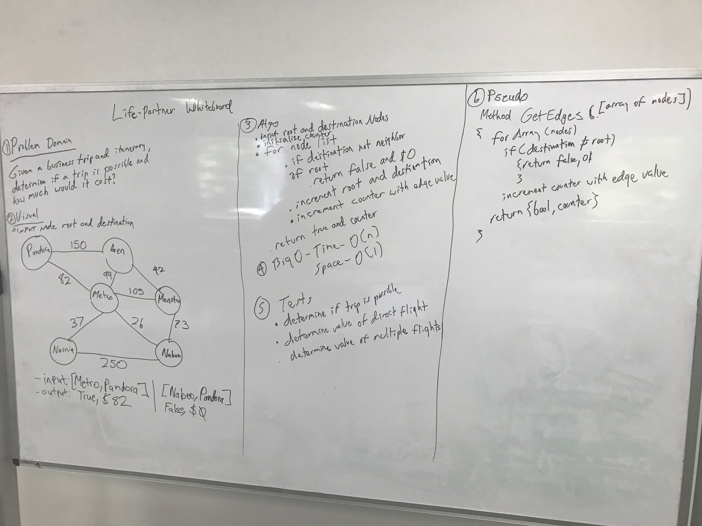

# Get Edge
"Given a business trip itinerary, and an Alaska Airlines route map, is the trip possible with direct flights? If so, how much will the total trip cost be?"

## Challenge
The challenge was to see if given an array, how to iterate through with certain key-value pairs. Example: Pandora can go to Metroville but cannot jump to Narnia. It must go through Metroville first instead of jumping straight to Narnia. If it does, the set value for each trip should be added. The way to keep track of this is to have a blank counter, which will add up and return.

## Solution

# Acknowledgements
Whiteboarding Partner - Jesse Atay