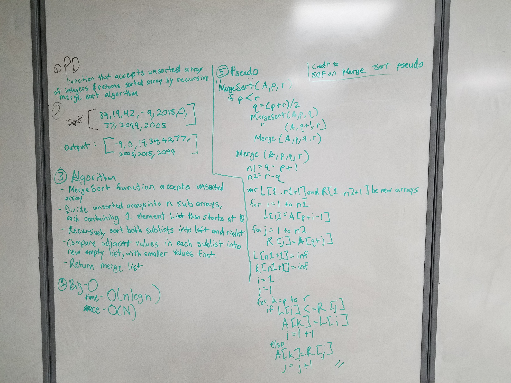

# Merge Sort
Implement a merge sort

## Challenge
The challenge is recursively merge an unsorted array into a sorted array via merge sort. Two empty arrays will be instantiated. The function will break the original unsorted array into single elements. And sort adjacent elements into either the first or second empty array. We'll call these left and right for visual ease. The elements will form in two's. Then form in four's and eight's until all of the elements are accounted for into each array. Another method will then merge these two arrays together and create a sorted array. All this is done recursively since the function is calling itself to continuously sort the elements together to completion.

## Solution

# Acknowledgements
- https://stackoverflow.com/questions/20783096/mergesort-implementation-in-c-sharp
- https://en.wikipedia.org/wiki/Merge_sort
- https://medium.com/basecs/making-sense-of-merge-sort-part-1-49649a143478