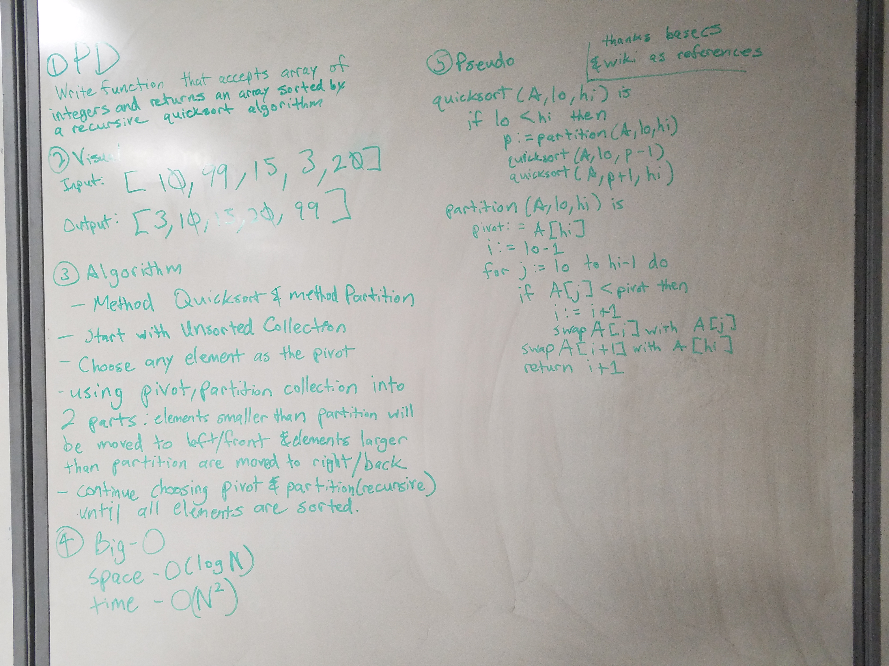

# Quick Sort
Implement a quick sort

## Challenge
The challenge is recursively sort an unsorted array into a sorted array via quick sort. A pivot or element will be picked. It can be anywhere. But typically, this can be at the beginning or end of an unsorted array. Ideally, it is in the middle for faster splitting. Once split into two arrays, the sort will then partition based on which is bigger or smaller. If smaller, the element will move to the left. If bigger, the element will then move to the right. This will continue until completely done.

## Solution

# Acknowledgements
- https://en.wikipedia.org/wiki/Quicksort
- https://medium.com/basecs/pivoting-to-understand-quicksort-part-1-75178dfb9313