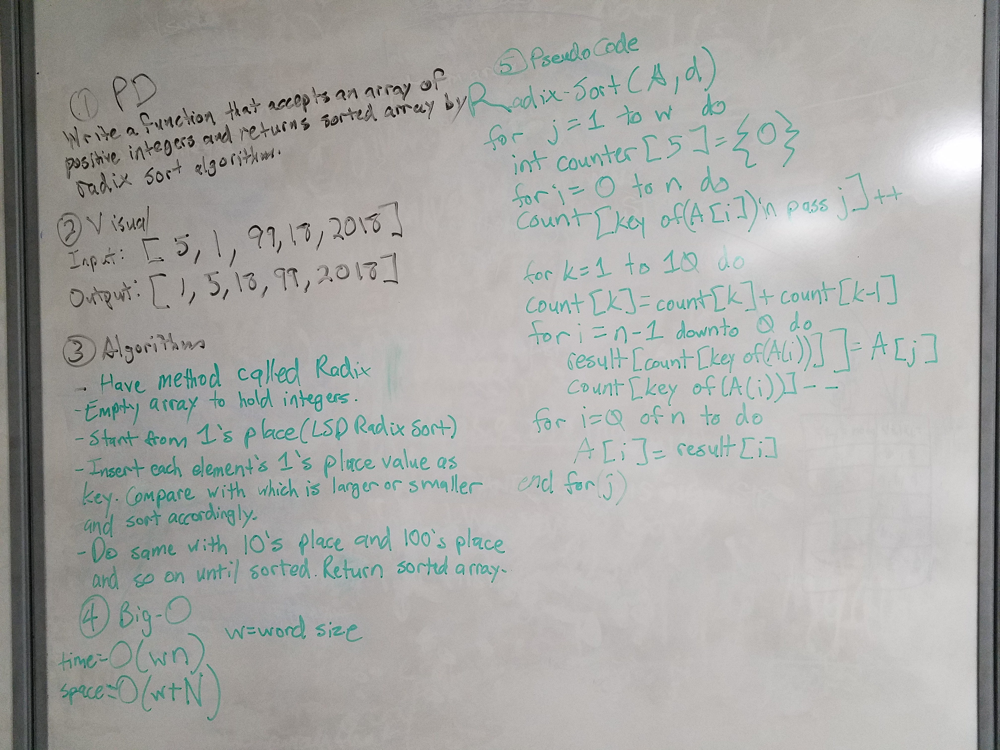

# Radix Sort
Implement a radix sort

## Challenge
The challenge is to sort an unsorted array of positive integers into a sorted array via radix sort. The chosen type of radix sort for this implementation is Least Significant Digit or LSD radix sort. First, an empty array will instantiate to house the array. The sort will have a counting sort. And start from the one's place. The values in the area will be sorted by their one's place. Next, the numbers will be sorted by their 10's place. And 100's. And so on. Until the numbers are completely sorted.

## Solution

# Acknowledgements
- https://en.wikipedia.org/wiki/Radix_sort
- https://medium.com/basecs/getting-to-the-root-of-sorting-with-radix-sort-f8e9240d4224
- https://www.codingeek.com/algorithms/radix-sort-explanation-pseudocode-and-implementation/