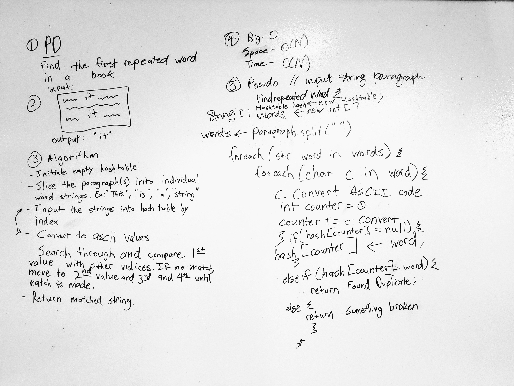

# Repeated Words
Find the first repeated word in a book.

## Challenge
The challenge is to find a repeated word. The way to do this is through a hash table. First, split the long paragraph string into individual words. And setting each word into the hash dynamically, one at a time. If any of the words show up as a repeat, output the repeated word.

## Solution

# Acknowledgements
Independent. Whiteboarded with Jermaine Walker and Collin Hintzke.