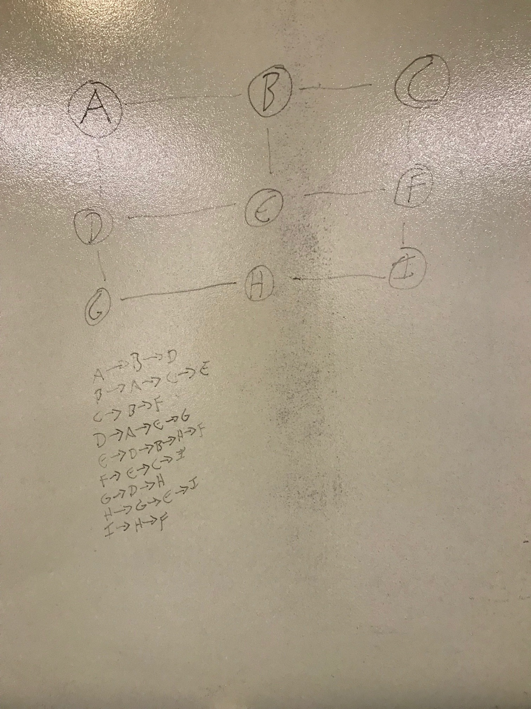

# Graphs

1. Visuals of what it looks like:

2. How you implemented it 
Graph is a data structure of nodes. Which can either be connected or on an 'island'. Each node could be standalone or connected to node. If they are, they have an Edge together and are Neighbors. And the node can be connected to any number of neighbors, not just one. The size can be any number as well except 0. 

3. What type of uses you would use this for (provide 2 examples)
	a. GPS and Mapping
	b. Driving Directions
	c. Social Networks
	d. Airline Traffic
	e. Netflix uses graphs for suggestions of products

[Instructor](Amanda Iverson)
[TA's](Philip Werner, Erik Plyushko, Jeff Martinez)
[Classmates](https://github.com/jcqnly, Jesse Atay)