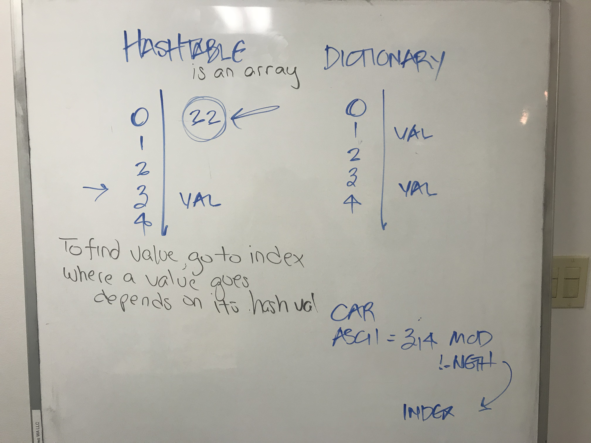

# Hashtables

1. Visuals of what it looks like:

2. How you implemented it 
Hash Table is a data structure. It intakes an array of values and indexes each value into a hash. Basically, it is utilized for a quick O(1) search. It is the same as a dictionary in C#. The add function is based on the modulus of the Ascii Value of each character. In the example, it is 'cat'. Each character has an Ascii Value and would be broken down then added to an empty counter. Once the values are added up in the counter, the index value will be calculated and inserted there.

3. What type of uses you would use this for (provide 2 examples)
	a. Finding colleges by their ID number (SAT).
	b. Finding Employee information by Employee number.

[Instructor](Amanda Iverson)
[TA's](Philip Werner, Erik Plyushko, Jeff Martinez)
[Classmates](https://github.com/jcqnly, Jermaine Walker)