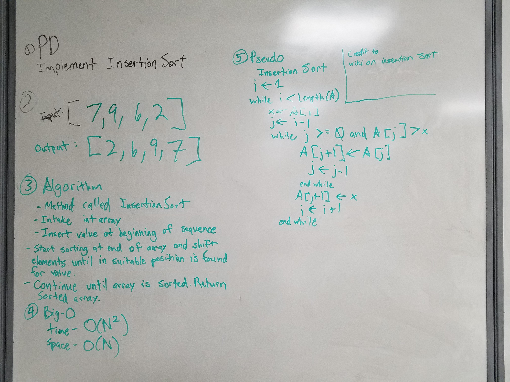

# Sorting Algorithms (Insertion Sort)

1. Visuals of what it looks like:

2. How you implemented it 
Sorting Algorithms are data structures. It intakes an array of values and moves the values around based whether the current value is larger or smaller than the adjacent value. If it is or not, the current value will move where appropriate. If it is larger, it will move to the right. If it is smaller, it will move to the left. Once completed, it will stop and return the array as sorted.

3. What type of uses you would use this for (provide 2 examples)
	a. "Efficient for (quite) small data sets, much like other quadratic sorting algorithms"
	b. "Efficient for data sets that are already substantially sorted"

[Instructor](Amanda Iverson)
[TA's](Philip Werner, Erik Plyushko, Jeff Martinez)
[Classmates](https://github.com/jcqnly)
[Reference for Uses](https://en.wikipedia.org/wiki/Insertion_sort)