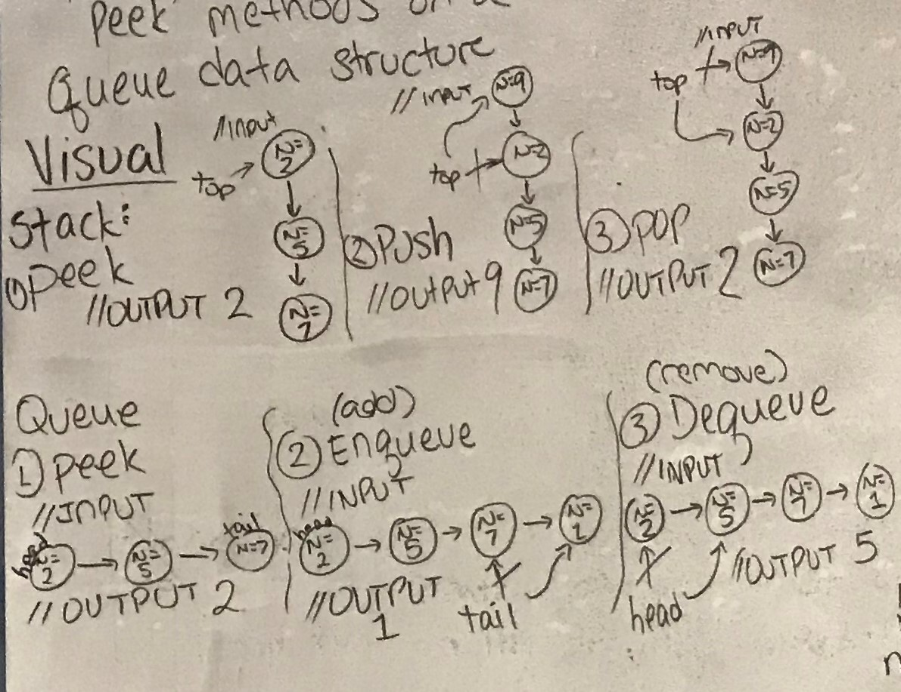

## Stacks and Queues ##

1. Visuals of what it looks like

2. How you implemented it 
For stacks, the nodes sit on top. The functionality of it is only two methods: pushing and popping. If pushed, a node goes in. If popped, a node comes out. Only one way in and one way out. First in, first out.
For queues, the nodes sit in a line. The functionality are two methods: queueing and dequeueing. If queued, the node goes into the front. If dequeued, a node comes out from the rear. First in, last out.

3. What type of uses you would use this for (provide 2 examples)
   a. "Calculators employing reverse Polish notation use a stack structure to hold values." 1*
   b. "Dynamic Memory Allocation" 2*

Acknowledgements
Instructor - Amanda Iverson
TA's - Philip Werner, Erik Plyushko
Classmates - Jimmy Chang for helping with unit testing. Jackie Ly for the whiteboard image.
1* = https://en.wikibooks.org/wiki/Data_Structures/Stacks_and_Queues
2* = https://www.sanfoundry.com/c-programming-examples-stacks/